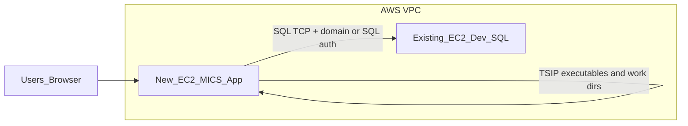
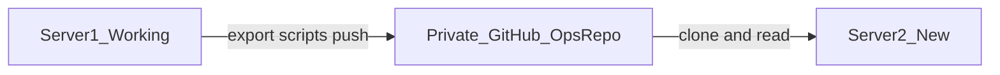

# MICS working copy on new AWS EC2

**Purpose:** Stand up a new Windows EC2 application host for MICS: deploy TSIP batch code and the classic IIS web stack, while using the **existing development SQL Server** (already on an EC2 instance in the **same Active Directory domain**).

**Repositories**

| Role | Repository | Notes |
|------|------------|--------|
| TSIP / batch (latest) | [FCSA2025/MicsBat](https://github.com/FCSA2025/MicsBat) | Build from `MicsBat.sln`; deploy binaries and supporting folders (`_bin`, `bin`, `packages`, per-project outputs as required). |
| Web (calls TSIP, loads DB) | [FCSA2025/MicsWebCodeClassic](https://github.com/FCSA2025/MicsWebCodeClassic) | IIS-hosted classic web; confirm ASP.NET / `web.config` requirements after clone. |

**Database:** No new SQL Server instance. Connection strings and permissions target the **current dev SQL EC2** (hostname/listener, same auth model as a known-good dev workstation).

**Optional ops repository:** A **private** GitHub repo (or a folder in an existing private repo) can hold **sanitized machine exports** from the working server so Cursor/agents on **Server 2** can read target IIS/layout/tasks without guessing. See [Two-server workflow](#two-server-workflow-exports-repo--agents-on-both-servers).

---

## Target architecture

---

## Two-server workflow: exports repo and agents on both servers

You can run Cursor (or similar) on **Server 1 (working)** and **Server 2 (new)** at the same time. Use a **private** Git repository as the handoff for **machine truth**—not secrets.

### How it helps

| If Server 2 is created by… | Role of the exports repo |
|----------------------------|---------------------------|
| **Launching a new instance from an AMI** of Server 1 | The disk already matches Server 1 closely. The repo still gives a **dated checklist** for post-clone work (rename, domain, certs, bindings) and helps the Server 2 agent **diff** “expected vs actual” after changes. |
| **Building Server 2 from scratch** (new volume, install IIS, deploy from Git) | The repo is **very** valuable: it describes how Server 1 is actually configured so Server 2 can be aligned quickly. |

### Workflow (high level)

1. **On Server 1:** Maintain scripts under `ops/scripts/` that write text reports to `ops/snapshots/YYYY-MM-DD/` (IIS sites/bindings/pools, scheduled tasks, features, redacted configs). Run them after meaningful changes.
2. **Push to GitHub:** Something on Server 1 must perform `git commit` and `git push` (you manually, or a scheduled task). Configure auth with a **deploy key**, **SSH key**, or **fine-scoped PAT** stored securely—not in the repo. The Cursor agent does not push by itself unless you run those commands with credentials already set up.
3. **On Server 2:** `git clone` the private ops repo (and MicsBat / MicsWebCodeClassic) into the Cursor workspace. The agent uses the **latest snapshot** as ground truth while fixing IIS, paths, and validation.

### Rules

- **No passwords or raw connection strings** in the ops repo—redact or use placeholders; keep secrets in SSM Parameter Store / Secrets Manager.
- **Date every snapshot** so Server 2 does not chase stale configuration.
- **AMI clones** still need a **unique computer name** and correct **domain** membership; two servers must not both claim the same identity on the network. Plan rename / rejoin steps with your AD admin if applicable.
- **HTTPS certificates** on Server 2 may need re-binding or re-issue after clone; exports document *what* was bound, not private key material in Git.

---

## AWS: create Server 2 (console-oriented, novice)

These steps assume you use the **AWS Management Console** in a browser. Pick the **same AWS Region** (top-right) where Server 1 and your SQL EC2 live unless your team standard says otherwise.

### Before you start (gather this)

- **VPC and subnet:** Which VPC/subnet Server 1 uses (EC2 → Instances → Server 1 → Networking tab). Using the **same subnet** (or same type of subnet) avoids surprises for domain DNS and internal routing.
- **Security group:** Name or ID of Server 1’s security group—you may **reuse** it or **clone** its inbound rules for Server 2.
- **Domain join:** Whether Server 2 must match Server 1’s OU/GPO; you may need your AD admin for computer account and DNS suffix.
- **Access method:** **AWS Systems Manager Session Manager** (no RDP port open) vs **RDP** (port 3389). Prefer **IAM instance profile with SSM** so you can connect without exposing RDP to the internet.

### Path A: Server 2 as a copy of Server 1 (AMI)

Best when you want the **fastest** duplicate of disk contents (IIS, installed programs, paths).

1. **Stop** Server 1 (optional but gives a quieter filesystem; many teams snapshot while running for dev—coordinate with users).
2. Open **EC2** → **Instances** → select Server 1 → **Actions** → **Image and templates** → **Create image**.
3. Set an **Image name** (e.g. `mics-app-server1-2026-04-01`). Create image. Wait until **AMIs** (left menu under *Images*) shows **Available**.
4. Select the new AMI → **Launch instance from AMI**.
5. **Name** the instance (e.g. `MICS-App-Server2`).
6. **Instance type:** Match or exceed Server 1 (e.g. `m5.xlarge`—your team picks size).
7. **Key pair:** If you already use one for Windows, choose it; if you rely on **Session Manager** only, key pair may be optional depending on how you get the Administrator password (SSM often used instead of RDP password).
8. **Network settings:** Pick the **same VPC** and a **subnet** that can reach the SQL EC2 and domain controllers. **Security group:** attach the same group as Server 1 or one with equivalent rules (RDP restricted to your IP if you use RDP; HTTP/HTTPS if the site is hit from browsers).
9. **Storage:** Match or exceed Server 1’s disk size so volumes do not fill unexpectedly.
10. **Advanced details** → **IAM instance profile:** Choose a role that includes **AmazonSSMManagedInstanceCore** (for Session Manager). If Server 1 has this, use the **same role** or a clone of it.
11. **Launch instance**. When **Running**, connect via **Session Manager** (Connect) or **RDP** using the elastic/public IP or DNS as your team does today.

**After first boot of an AMI clone:** Plan Windows steps with your team: **new computer name**, **domain rejoin or fix** if the clone confused AD, **unique IP/DNS record**, **SSL certificate** binding if HTTPS broke, and **Sysprep** only if your organization requires a generalized image (do not run Sysprep casually without a runbook—it resets machine state).

### Path B: Server 2 brand new (clean Windows, no AMI)

Best when you want a **clean** OS and will install IIS and deploy from **MicsBat** / **MicsWebCodeClassic** (and use the **ops exports** repo to mirror Server 1).

1. **EC2** → **Launch instance**.
2. **Name:** e.g. `MICS-App-Server2`.
3. **Application and OS Images:** **Windows Server** (same major version as Server 1 if possible, e.g. 2022).
4. **Instance type:** Choose size per workload (start similar to Server 1).
5. **Key pair:** Create or select (needed for some Windows password retrieval flows; SSM may still be primary).
6. **Network settings:** Same VPC/subnet strategy as Path A. Create or select **security group**: allow **outbound** (default). Inbound: **3389** only from **your IP** if using RDP; **80/443** if users or load balancers hit the web UI directly (tighten sources per your security policy).
7. **Storage:** Set root volume size (e.g. 100–200+ GiB for builds and logs—match your Server 1 pattern).
8. **Advanced details** → attach **IAM role** with **SSM** (`AmazonSSMManagedInstanceCore`).
9. **Launch instance**. Connect with **Session Manager** or **RDP**, **activate Windows** (usually automatic on AWS license-included AMIs), then follow [Phase 2](#phase-2-software-installation) onward in this document.

### After the instance is running (both paths)

1. **Elastic IP (optional):** If Server 1 uses a **static public IP**, allocate an **Elastic IP** in **EC2** → **Elastic IPs** → **Allocate** → **Associate** with Server 2 so DNS or firewall rules can point to a stable address.
2. **Security group on SQL EC2:** Add an inbound rule allowing **Server 2’s security group** (or private IP) to **TCP 1433** (or your SQL port) on the **SQL Server instance**—otherwise the app on Server 2 cannot reach the database.
3. **Domain join:** Join Server 2 to the same domain as Server 1 (System Properties / PowerShell); reboot as required.
4. **Clone repos on Server 2:** Private ops repo (exports) + MicsBat + MicsWebCodeClassic; open the folder in Cursor.

### AWS terms quick reference

| Term | Meaning |
|------|--------|
| **Region** | Geographic area for your resources; resources in different regions do not see each other by default. |
| **VPC** | Your private network in AWS; subnets live inside it. |
| **Security group** | Stateful firewall attached to an instance **network interface**; you allow ports and sources here. |
| **AMI** | Saved disk image used to launch a new instance (Path A). |
| **IAM role / instance profile** | Lets the EC2 instance call AWS APIs; Session Manager needs **AmazonSSMManagedInstanceCore** on the role. |
| **EBS volume** | The virtual disk for the instance; size and type set at launch (can be expanded later). |

---

## Prerequisites

- **Active Directory:** New EC2 is **domain-joined** to the same forest as the SQL EC2 (match how existing dev/prod app servers are joined and which OU/GPOs apply).
- **Network:** AWS security groups **and** Windows Firewall on the **SQL EC2** allow inbound from the **new app EC2** (by security group or subnet) on **TCP 1433**, or the **non-default port** if dev SQL uses one. Confirm **network ACLs** do not block the path.
- **DNS:** The dev SQL **hostname** resolves from the new EC2 (domain DNS, Route53, or hosts file only as a last resort).
- **Secrets:** Store connection strings and passwords outside Git (SSM Parameter Store, Secrets Manager, or secured on-server config).

---

## Phase 1: EC2 provisioning (application server)

1. Choose **Windows Server** version aligned with IIS and .NET Framework needs (e.g. 2019 or 2022).
2. Instance size: sufficient CPU/RAM for IIS plus TSIP batch work; resize after smoke tests if needed.
3. Attach an **IAM instance profile** with **SSM** for Session Manager (recommended alongside RDP).
4. **Disks:** Plan OS volume plus a data volume if logs, uploads, or TSIP outputs are large; legacy code may assume specific **drive letters**—either mirror the layout or plan config changes.
5. **Domain-join** the instance and apply the same baseline as other MICS app servers.

---

## Phase 2: Software installation

1. **IIS** with the ASP.NET / .NET Framework features required by MicsWebCodeClassic (verify from solution and `web.config` after clone).
2. **Build tools:** Visual Studio Build Tools or Visual Studio, **MSBuild**, **NuGet** CLI or VS restore.
3. **Git** for cloning [MicsBat](https://github.com/FCSA2025/MicsBat) and [MicsWebCodeClassic](https://github.com/FCSA2025/MicsWebCodeClassic) to stable paths (for example `C:\src\MicsBat`, `C:\src\MicsWebCodeClassic`).
4. Deploy **built artifacts** to runtime locations: IIS site physical path for the web app; file-system layout for batch/TSIP consistent with how the web invokes them.

---

## Phase 3: Build and deploy

1. Clone both repositories; run **NuGet restore** and build **MicsBat.sln** (and the web solution if separate).
2. Publish or copy web output to the IIS site directory; copy batch binaries and dependencies to the agreed runtime tree.
3. **IIS:** Create application pool and site; set bindings (HTTP/HTTPS and certificate if required). App pool identity must be able to run TSIP-related processes, read/write working directories, and access SQL if using integrated authentication.

---

## Phase 4: Configuration

1. **SQL:** Point all connection strings (and ODBC, if used) to the **dev SQL EC2** host and database. Match **Windows vs SQL authentication** to a working dev environment.
2. **Paths:** Audit for hard-coded paths (batch logs, file gates, report folders). Prefer mirroring known drive layout on the new server; document any intentional path overrides.
3. **TSIP:** Ensure the effective user (app pool, scheduled task, or service account) has rights to executables, queues, locks, and output directories, consistent with current dev behavior.

---

## Phase 5: Validation checklist

- [ ] From new EC2: `Test-NetConnection <sqlhost> -Port 1433` (or actual SQL port) succeeds.
- [ ] Database login using the **same principal** as the app succeeds against the MICS dev database.
- [ ] IIS serves the site; authentication pages or APIs behave as on reference dev.
- [ ] One **end-to-end flow** that queues or runs TSIP completes; verify DB updates and expected log/output files.
- [ ] No recurring permission or connection errors in TSIP and web logs.

---

## Cursor and project setup for maximum visibility

When Cursor (or another agent) runs **on the EC2 host**, it only sees **files in the workspace** plus **terminal output** you generate. It does **not** auto-discover IIS. Use the practices below so configuration and runtime layout are searchable and reproducible.

### Workspace layout

- Open a folder or **multi-root workspace** that includes:
  - **Source:** Local clones of MicsBat and MicsWebCodeClassic (or your combined layout).
  - **Runtime (optional):** IIS site physical path(s) and batch install directories, if policy allows those paths in the workspace. If not, use **exported copies** under a project folder (see below).
- Suggested on-server tree: `C:\src\...` for Git repos and `C:\src\<monorepo-or-ops>\ops\` for exports and scripts (adjust names to match your standard).

### Machine truth in the repo (exports, not live secrets)

Refresh after meaningful IIS or deploy changes:

- **IIS:** PowerShell output listing sites, bindings, application pools, and applications (and optionally a **redacted** snippet of relevant config). Prefer repeatable `.ps1` scripts checked into `ops/scripts/` so anyone can re-run them.
- **Windows:** Installed features (IIS / .NET), scheduled tasks that invoke TSIP or MICS batch jobs, relevant Windows services.
- **Connectivity:** e.g. `Test-NetConnection <sqlhost> -Port <port>` result documented in the snapshot notes (no credentials in the file).

Store outputs under something like `ops/snapshots/YYYY-MM-DD/` and add one line in each snapshot folder describing **how** it was produced and **when** to refresh.

For `web.config` and similar: either **tokenized** copies with placeholders, **sanitized** exports, or reference paths only—**do not** commit production passwords; use SSM Parameter Store / Secrets Manager and document **parameter names** in ops notes.

### Terminal and privileges

- Many IIS queries work as a normal user; reading some paths, the certificate store, or full `applicationHost.config` details may require **Run as Administrator** (or an ops account). If a command fails with “access denied,” retry from an elevated terminal and note that requirement in `AGENTS.md` (below).

### Project signposts for agents and humans

- Add **`AGENTS.md`** or **`README-ops.md`** at the workspace root (or under `ops/`) with:
  - Absolute paths to IIS site root, TSIP/batch roots, and log directories.
  - How SQL connectivity is configured (integrated vs SQL auth) without storing secrets—reference SSM/secret names.
  - Application pool identity (account name) and how TSIP is started (IIS child process, scheduled task, service).
- Optional **`.cursor/rules`**: remind contributors to update `ops/snapshots` after deployment changes and to run the inventory script.

### `.cursorignore` / `.gitignore`

- Avoid ignoring **`web.config`** or entire `inetpub` trees if that is the only copy the agent can read. Prefer ignoring **bin/obj**, large binaries, and huge log directories while keeping **small configs** or **sanitized** copies under `ops/` unignored.

### Logs

- Document **log paths** in `AGENTS.md`. For troubleshooting, capture **recent excerpts** (tail of file) into `ops/incidents/<ticket-or-date>/` so the agent can read them without loading multi-gigabyte logs.

### Optional: one-shot inventory script

A single PowerShell script can write a text report: IIS sites/bindings/pools, app pool identity **names**, installed .NET versions, and scheduled tasks filtered by name (e.g. MICS/TSIP). Run after each deploy; diff the text output over time instead of relying on memory.

### What remains hard to see (even on-box)

- **Live** request traffic, w3wp internals, and transient failures—unless you capture logs, failed-request traces, or explicit diagnostics.
- **Other tiers:** SQL Server settings, AWS security groups, load balancers—only inferred from connectivity tests unless you document them elsewhere.
- **Encrypted** `web.config` sections and **private keys**—tied to the machine; the agent may see that encryption exists, not usable secrets without proper decryption and policy.

---

## Risks and mitigations

| Risk | Mitigation |
|------|------------|
| Kerberos / double-hop from IIS to SQL | Mirror working dev: service account, app pool identity, or constrained delegation as already proven. |
| Firewall gaps | Open path on **both** AWS SG and **Windows Firewall** on SQL EC2. |
| Hard-coded paths | Inventory during clone; align drives or update config in a tracked change set. |

---

## Optional follow-ups

- Infrastructure as code (CloudFormation/Terraform) for the new EC2 and security group rules.
- Golden AMI after a validated build.
- Backup and patch policy for the new host separate from the SQL EC2.

---

## Action tracker

| # | Task | Status |
|---|------|--------|
| 1 | Open SG + Windows Firewall: new app EC2 → dev SQL EC2; verify DNS | |
| 2 | Provision Windows EC2, domain-join, IAM/SSM, disks for logs/work files | |
| 3 | Install IIS + .NET Framework features, Git, MSBuild/VS Build Tools, NuGet | |
| 4 | Clone MicsBat + MicsWebCodeClassic; restore; build; deploy web and batch | |
| 5 | Configure connection strings, paths, app pool identity and TSIP permissions | |
| 6 | SQL + IIS + end-to-end TSIP smoke test; review logs | |
| 7 | Cursor/workspace: add `AGENTS.md` (or `README-ops`), `ops/snapshots` + inventory script; avoid over-broad `.cursorignore` on configs | |
| 8 | Create **private** GitHub ops repo (or `ops/` in existing repo); configure **git push** auth on Server 1 (deploy key / PAT / SSH) | |
| 9 | **AWS:** Create Server 2 via **Path A (AMI)** or **Path B (clean Windows)** in console; IAM role for SSM; security group; optional Elastic IP | |
| 10 | **AWS + AD:** Update **SQL EC2 security group** for Server 2; **domain-join** Server 2; post-AMI rename/cert/bindings if applicable | |
| 11 | On Server 2: clone ops repo + Mics repos; validate against latest snapshot; complete Phases 2–5 | |

*Document status: planning. Update the action tracker as work completes.*
